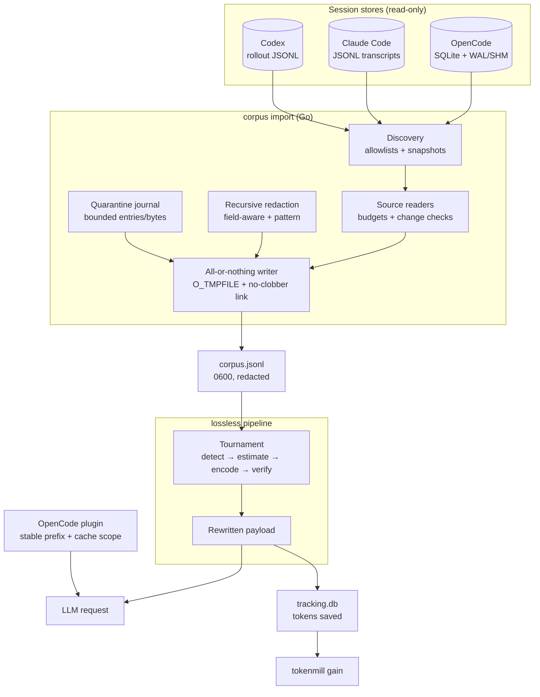

# 🌀 Tokenmill

<div align="center">

**Lossless token compression for LLM chat transcripts**

Import OpenCode, Claude Code, and Codex session stores into a tamper-evident, redacted corpus, then shrink replay payloads with a tournament of 17 lossless codecs — byte-exact or data-exact, always verified, never silently lossy.

[](https://go.dev/)
[](https://gitlab.com/cznic/sqlite)
[](https://github.com/openai/tiktoken)
[](https://www.typescriptlang.org/)
[](https://bun.sh/)

[](https://github.com/4q4r/tokenmill/actions/workflows/ci.yml)
[](https://github.com/4q4r/tokenmill/commits/main)
[](https://github.com/4q4r/tokenmill)
[](https://github.com/4q4r/tokenmill)
[](LICENSE)

[Architecture](#-system-architecture) · [Techniques](#-lossless-techniques) · [Benchmarks](#-measured-performance) · [Security](#-security) · [Quick Start](#-quick-start)

</div>

---

## 📑 Table of Contents

- [System Architecture](#-system-architecture)
- [Project Structure](#-project-structure)
- [Core Modules](#-core-modules)
- [Lossless Techniques](#-lossless-techniques)
- [Measured Performance](#-measured-performance)
- [Security](#-security)
- [Configuration](#-configuration)
- [Quick Start](#-quick-start)
- [Testing](#-testing)
- [License](#-license)

---

## 🗺️ System Architecture



Request flow:

1. Discovery resolves each source store through strict, per-source path
   allowlists and snapshots it (content hash, inode, companions).
2. The source reader imports records inside a read-only transaction on a
   private snapshot; any source change mid-read fails the import closed.
3. Every record passes recursive credential redaction before it can reach the
   writer; values that survive redaction are skipped into a bounded journal
   instead of being published.
4. The all-or-nothing writer publishes the corpus with a single no-clobber
   link from an anonymous `0600` temporary — a failed run never leaves a
   partial file.
5. The lossless tournament picks, per payload, the codec with the best
   verified token savings above the configured thresholds; payloads below the
   gates pass through untouched.
6. The OpenCode plugin keeps the stable conversation prefix intact so
   provider prompt caching continues to hit.

---

## 📂 Project Structure

```text
tokenmill/
├── cmd/
│   ├── tokenmill/                CLI: init, config, rewrite, gain, stats
│   └── rating/                   corpus rating helper
├── internal/
│   ├── corpus/                   import adapters, all-or-nothing writer, redaction
│   ├── codec/                    lossless codec implementations + registry
│   ├── tournament/               per-payload codec selection (detect/estimate/verify)
│   ├── technique/                canonical technique IDs and aliases
│   ├── tokenizer/                tiktoken o200k_base counting with memo cache
│   ├── cache/                    provider-neutral prefix-cache metadata
│   ├── replay/                   canonical replay record schema
│   ├── dedup/                    SHA-256 cross-call dedup store
│   ├── packer/                   cross-call dictionary packer
│   ├── dictionary/               path/URL/substring dictionaries
│   ├── detector/                 code-block and content detection gates
│   ├── terminal/                 ANSI strip + carriage-return render
│   ├── table/                    box-drawing/fixed-width table → TSV
│   ├── rle/                      exact RLE and block factoring
│   ├── stacktrace/               stack-trace dictionary codec
│   ├── stats/                    tracking.db (savings history)
│   └── config/                   single-source configuration
├── plugin/
│   ├── tokenmill.ts              OpenCode plugin: stable prefix, cache scopes
│   ├── tokenmill.test.ts         plugin test suite (Bun)
│   └── tui/tokenmill-stats.tsx   OpenCode TUI savings widget (SolidJS)
├── testdata/                     source-format fixtures (chat archives)
├── scripts/                      development helpers
└── .opencode/tokenmill.jsonc     example project configuration
```

---

## 🧩 Core Modules

| Module | Purpose |
| :-- | :-- |
| `corpus` | Read-only import of OpenCode/Claude/Codex stores — streamed per session so peak memory tracks the largest session, not the store — with redaction, quarantine, and all-or-nothing atomic publication |
| `codec` + `tournament` | 17 lossless codecs and the per-payload selection tournament with verification gates |
| `tokenizer` | Accurate `o200k_base` token counting, savings math, memoized counter |
| `cache` | Provider-neutral prompt-cache metadata: model-family detection, breakpoint planning (Anthropic-style explicit markers; implicit for OpenAI/Google), stable prefixes, cache scope keys |
| `plugin/tokenmill.ts` | OpenCode plugin: keeps the conversation's stable prefix untouched and computes cache scopes per tool schema |
| `stats` | SQLite tracking of every rewrite: tokens in/out, saved, percentage |
| `config` | One configuration source (`tokenmill.jsonc`) mirrored across CLI and plugin |

---

## 🗜️ Lossless Techniques

Every technique verifies its own output: byte-exact for plain text,
data-exact for canonical JSON forms. Codecs that cannot prove losslessness
fall back to the original bytes.

| Technique | Codec ID | Default | What it does |
| :-- | :-- | :--: | :-- |
| ansi | `ansi-strip` | ✅ | Removes ANSI escape sequences (colors, cursor moves) from terminal output |
| cr | `cr-render` | ✅ | Collapses `\r` progress bars to what a human actually saw on screen |
| rle | `exact-rle` | ✅ | Run-length encodes repeated characters (min run 3) |
| block | `block-factor` | ✅ | Folds repeated 2–20 character blocks (rules, indentation runs) |
| path-dict | `path-dict` | ✅ | Replaces repeated file paths/URLs with short codes + embedded dictionary |
| json-compact | `json-compact` | ✅ | Strips insignificant JSON whitespace |
| jton | `jton-zen` | ✅ | Homogeneous JSON arrays (≥10 rows) → columnar `key;value` notation |
| table-tsv | `table-tsv` | ✅ | Box-drawing/fixed-width tables (≥5 rows) → TSV; cells verified |
| stacktrace | `stacktrace-dict` | ✅ | Dictionary-codes repeated stack-trace frames and paths |
| jcs | `jcs` | ✅ | Canonical JSON: sorted keys, compact form (data-exact) |
| json-number | `json-number` | ✅ | Canonical number formatting (data-exact) |
| dedup | `dedup-sha256` | ✅ | Cross-call dedup: repeats become `§ref:HASH8§`; first occurrence never mutated |
| markdown-whitespace | `markdown-whitespace` | ❌ | Collapses markdown whitespace runs |
| opaque-dict | `opaque-dict` | ❌ | Dictionary for base64/UUID/URL opaque runs |
| cross-call pack | `cross-call-pack` | ❌ | Session-wide shared dictionary packer |
| csv-canonical | `csv-canonical` | ❌ | Canonical CSV quoting and separators |
| symbol-table | `symbol-table` | ❌ | Repeated word-like tokens → abbreviation table |
| text-norm | `text-norm` | ✅ | Strips invisible Unicode (zero-width, soft hyphens, BOM, bidi/tag/control characters), maps NBSP and exotic spaces to plain space, composes NFC — the copy-paste junk that inflates tokens and destabilizes tokenization |
| html-entity | `html-entity` | ✅ | Decodes HTML entities (`&amp;` `&lt;` `&#39;`…) into the characters a reader actually sees |
| base64-compact | `base64-compact` | ✅ | Removes line-wrapping whitespace inside decodable base64 payloads (byte-lossless by spec); undecodable runs are never touched |
| diff-log-fold | `diff-log-fold` | ❌ | Folds exact adjacent line/block repeats in logs |

The tournament applies a codec only when verified savings clear both gates
(`minSavingsTokens` and `minSavingsPercent`); otherwise the original text is
sent unchanged.

---

## 📊 Measured Performance

Measured 2026-08-29 against a real **4.67 GB OpenCode store** (48,779 records
imported; 4,079-message random sample, 19.5 M tokens, `o200k_base`):

| Scenario | Applied to | Saved tokens | Delta |
| :-- | --: | --: | --: |
| path-dict alone | 25.1 % | ~323 k | **1.7 %** |
| tournament, all codecs | <0.1 % | — | 1.4 % (text-only sample) |
| tournament, default gates | 0 % | 0 | 0 % |

- Chat transcripts are ~97 % assistant prose; these codecs target
  machine-shaped content (terminal output, tables, JSON, stack traces), so
  plain-chat savings are inherently small. The codecs pay off on tool-output
  payloads, which is what the OpenCode plugin compresses in daily use.
- **Prefix-cache proxy: 100.00 %** both with and without the pipeline over a
  120-step growing conversation — per-message stateless codecs keep the
  provider prompt cache fully warm.
- **Plugin end-to-end over live tool outputs** (3,528 real bash/patch/file
  results, 12.6 MB): the stable-prefix transform fires only on its narrowly
  recognized metadata pattern (0 of 3,528 outputs — conservative by design),
  reordering is byte-exact where it fires, throughput is 219 MB/s, and cache
  scopes are deterministic across 50 repeats while staying distinct per tool.
- Losslessness held everywhere: the only verify failures were 1.2 % of tables
  under `table-tsv`, which passed through uncompressed.
- Every number is reproducible: the gates below run the same code paths.

---

## 🔒 Security

- **All-or-nothing publication** — output is written to an anonymous
  `O_TMPFILE` at mode `0600` and appears atomically via a no-clobber,
  descriptor-relative `linkat`; any failure (flush, sync, identity check,
  cleanup) unlinks the output instead of leaving a partial corpus.
- **Descriptor-anchored traversal** — sources are opened with component-wise
  `openat`/`O_NOFOLLOW` via `golang.org/x/sys/unix` (portable across all
  Linux architectures); hashes and reads are pinned to held descriptors, so
  path races cannot swap files mid-read.
- **Fail-closed source integrity** — database + WAL/SHM companions are
  snapshotted before and after every read; any change returns
  `E_SOURCE_CHANGED` and publishes nothing.
- **Recursive redaction** — credential-shaped fields (keys, tokens, cookies,
  authorization headers, nested and double-serialized JSON) are removed
  before publication; values that survive redaction are skipped into the
  journal, never published.
- **Bounded quarantine journal** — rejected entries are capped by count and
  bytes (4096 entries / 16 MiB by default); exhausting the budget fails the
  import closed. Journal raw bytes stay in memory only.
- **Tolerant, never silent** — skipped entries are journaled with stable
  codes (`E_INPUT_JSON`, `E_SECRET_IN_CORPUS`) and are observable through
  `Writer.Quarantined()`.
- **No new dependencies** — pure-Go SQLite (`modernc.org/sqlite`), no CGO, no
  shelling out to binaries.

---

## ⚙️ Configuration

Tokenmill reads one configuration file, `tokenmill.jsonc` (mirrored in
`.opencode/tokenmill.jsonc`):

```jsonc
{
  "enabled": true,
  "minSavingsPercent": 10,     // tournament gate: minimum savings percent
  "minSavingsTokens": 32,      // tournament gate: minimum saved tokens
  "freshnessTurns": 20,        // dedup reference freshness
  "techniques": {
    "ansiStripping": true,
    "pathDict": { "enabled": true, "maxCodes": 5, "minCount": 3 },
    "jton": { "enabled": true, "minRows": 10 },
    "crossCallPack": false     // session-wide dictionary (opt-in)
  }
}
```

Defaults live in `internal/config/config.go` — one source of truth, no
fallback chains.

---

## 🚀 Quick Start

### 1. Build

```bash
go build ./cmd/tokenmill
```

### 2. Import a session store into a redacted corpus

```go
source := corpus.NewOpenCodeSource() // resolves via `opencode db path`
artifacts, _ := source.Discover(ctx, corpus.Options{OutputPath: "corpus.jsonl"})
writer, _ := corpus.NewWriter(corpus.Options{OutputPath: "corpus.jsonl"})
for _, a := range artifacts {
    _ = source.Read(ctx, a, writer)
}
_ = writer.Close() // atomic publish or nothing
```

### 3. Compress a payload through the tournament

```bash
tokenmill rewrite --raw "$(some-tool-output)"
```

### 4. See cumulative savings

```bash
tokenmill gain            # summary + daily/weekly/monthly history
tokenmill gain --history  # per-command records
```

### 5. Use with OpenCode

Copy `plugin/tokenmill.ts` into your OpenCode plugin directory and
`plugin/tui/tokenmill-stats.tsx` into the TUI plugin directory (see
`tokenmill init -g --opencode`).

---

## ✅ Testing

Go (race suite; the corpus package is Linux amd64/arm64 by build constraint):

```bash
test -z "$(gofmt -l internal cmd scripts)"
go test -race ./...
go build ./...
go vet ./...
golangci-lint run ./...
```

OpenCode plugin (Bun):

```bash
bun install --frozen-lockfile
bun test plugin/tokenmill.test.ts
```

Container and dependency scanning are covered locally by Trivy
(`trivy fs --scanners vuln,secret,misconfig .`); CI runs the Go and plugin
suites on every push (`.github/workflows/ci.yml`).

---

## 📄 License

[MIT](LICENSE)
